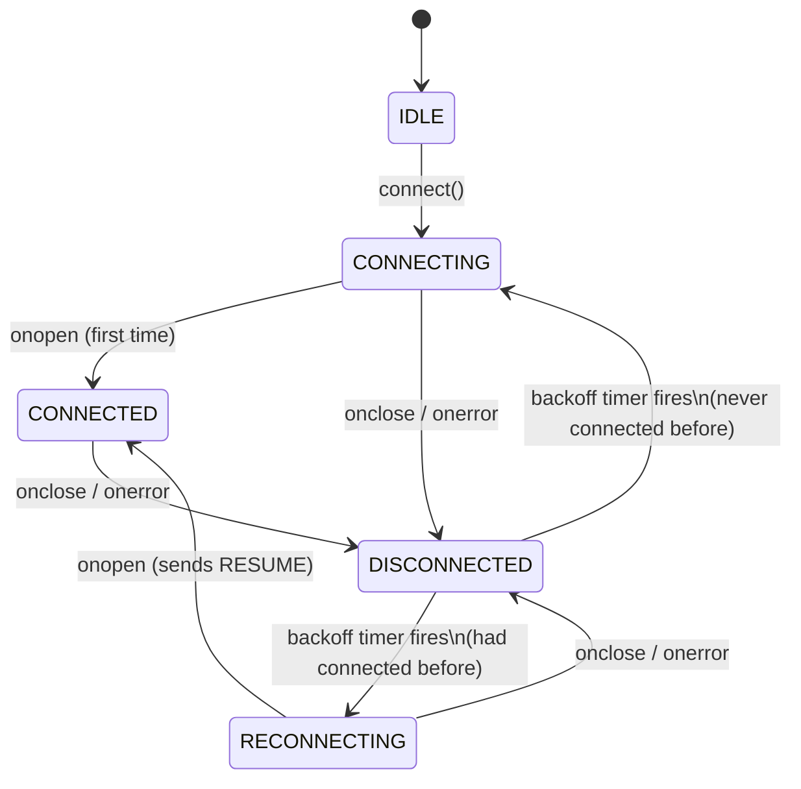
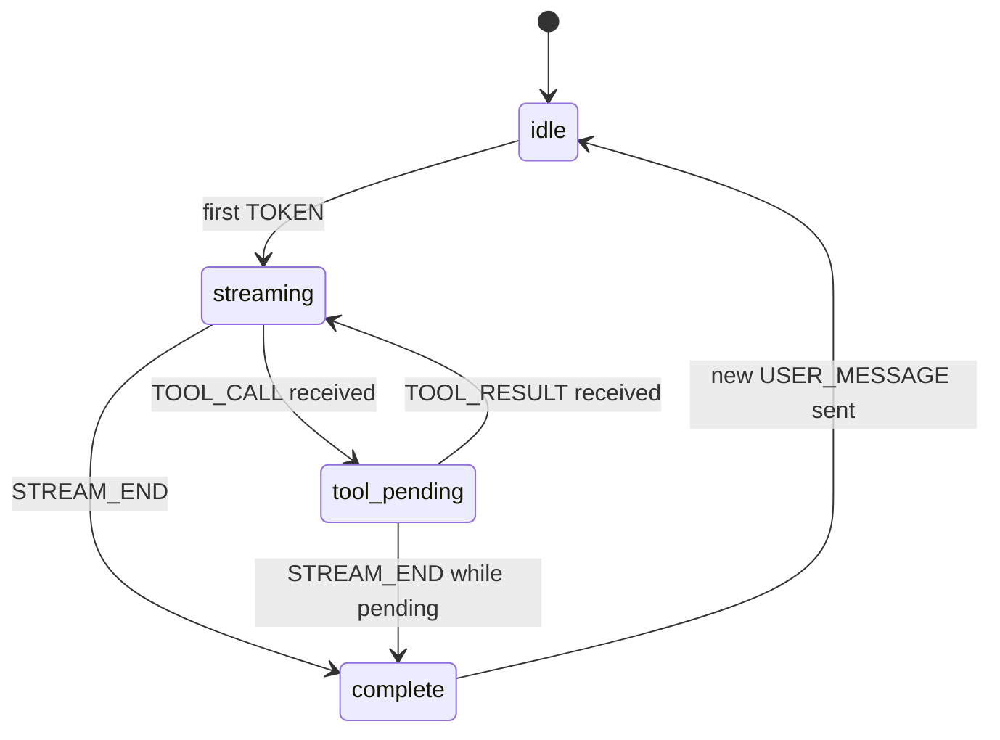
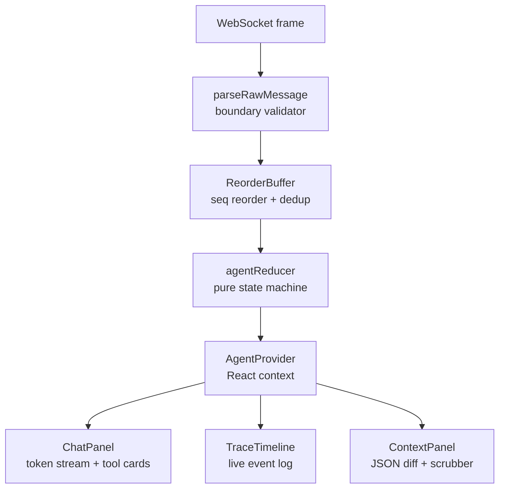

# Agent Console

A real-time AI agent console built with Next.js 16. It connects to a streaming WebSocket backend, renders token-by-token responses with mid-stream tool call cards, shows a live trace timeline of every protocol event, and survives chaos mode (out-of-order delivery, connection drops, duplicate messages, 500 KB+ payloads) without losing state or rendering corrupt output.

## Demonstration Video
Watch the Chaos Mode Survival demonstration here: [https://youtu.be/Vcvxmu9POLM](https://youtu.be/Vcvxmu9POLM)

## Architecture

The app is split into three layers that evolve independently:

| Layer | Location | Responsibility |
|---|---|---|
| **Connection** | `lib/protocol/` | WebSocket lifecycle, PING/PONG, backoff reconnection, message reordering |
| **Agent State** | `lib/agent/` | Pure reducer: server messages → typed UI state |
| **UI** | `components/` | React components that read state and render |

### State Machines

**Connection state** — owned by `WSClient`:



**Stream state** — owned by `agentReducer`:



### Data Flow



## Running

### Docker — recommended, zero setup

```bash
# From AlchemyAI/
docker build -t agent-server ./agent-server
docker compose up
```

Open **http://localhost:3000**. The server runs on `ws://localhost:4747/ws`.

To run in chaos mode:

```bash
docker compose down
docker run -d -p 4747:4747 agent-server --mode chaos
docker compose up agent-console
```

### Local development

```bash
# Terminal 1 — backend
cd agent-server && npm install && npm run dev

# Terminal 2 — frontend
cd agent-console && npm install && npm run dev
```

### Local production build

```bash
cd agent-console
npm install && npm run build && npm run start
```

## Testing

### Unit tests (115 assertions)

```bash
cd agent-console && npm test
```

Covers: protocol parser, reorder buffer, agent reducer, JSON diff algorithm.

### Integration tests (24 assertions, 0 protocol violations)

```bash
# Requires agent-server running on port 4747
node agent-server/run-tests.mjs
```

Covers: normal flow, tool call + ACK, multi-tool, PING/PONG, RESUME, TOOL_ACK logging, 500 KB+ context, `/log` clean check.

### Protocol compliance

```bash
curl -s http://localhost:4747/log | python3 -m json.tool
# Every entry should show "verdict": "ok"
```

## Trigger Keywords

| Message contains | Script | What it exercises |
|---|---|---|
| `hello` / `hi` | Greeting | Token streaming, CONTEXT_SNAPSHOT |
| `report` / `summary` / `q3` | Report | One TOOL_CALL mid-stream |
| `analyze` / `compare` | Analysis | Two sequential TOOL_CALLs |
| `lookup` / `find` / `search` | Lookup | TOOL_CALL before any tokens |
| `schema` / `database` / `large` | Schema | 500 KB+ CONTEXT_SNAPSHOT |
| `long` / `detailed` / `document` | Long | Many tokens + TOOL_CALL |

## Project Structure

```
AlchemyAI/
├── agent-console/              # Next.js 16 App Router Frontend
│   ├── lib/
│   │   ├── protocol/           # WebSocket, parser, reorder buffer
│   │   ├── agent/              # Pure reducer & context provider
│   │   ├── timeline/           # Trace timeline grouping logic
│   │   └── context-inspector/  # JSON diff engine
│   ├── components/             # React UI components
│   └── __tests__/              # Jest unit tests
├── agent-server/               # Mock AI Agent WebSocket Server
├── README.md                   # This file
└── DECISIONS.md                # Architectural decisions & rationale
```
